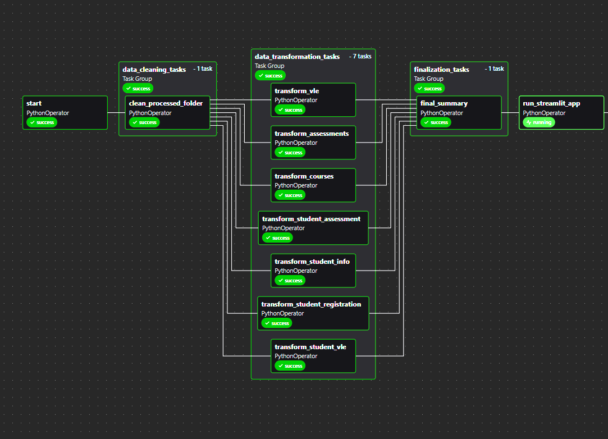

# student_performance_datapipeline

This project is designed to perform analysis on student performance data using a modern ETL pipeline built with **Apache Airflow v3**, **Apache Spark**, and **Streamlit**. The goal is to process and transform the data, then store it in a format that is easy to analyze and visualize.

This pipeline is implemented using **Apache Airflow v3**, which allows for task scheduling, monitoring, and orchestration. Airflow's new features like DAG versioning and assets are utilized to improve the management of the pipeline.

## Data

The dataset used in this project consists of student performance data. It includes various tables such as:

- **Student Information**: Contains details about each student.
- **Courses**: Information about the courses students are enrolled in.
- **Assessments**: Details about assessments and their weight.
- **Student Assessments**: Scores for each student in different assessments.
- **Registrations**: Data about student registration and unregistration.
- **VLE Interactions**: Information about student interactions with the Virtual Learning Environment (VLE).

These datasets are cleaned, transformed, and stored using Spark to facilitate efficient analysis.
### Project Architecture

### Airflow DAG
This image shows the DAG that orchestrates the ETL pipeline. Each task in the pipeline is handled by different operators in Airflow.

### Streamlit Dashboard
Once the data is processed, a simple Streamlit dashboard is used to display insights from the student performance data.

## Technologies Used

- **Apache Airflow v3**: For task scheduling and orchestration.
- **Apache Spark**: For large-scale data processing.
- **Streamlit**: For creating an interactive dashboard.
- **Python**: For scripting the ETL pipeline and transformations.
